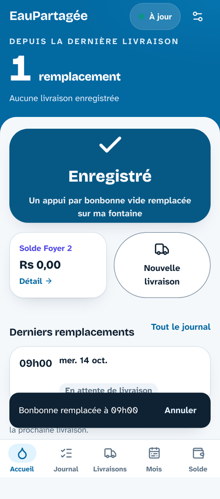
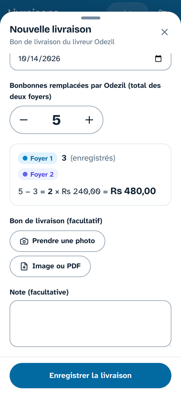
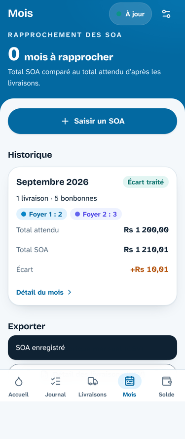
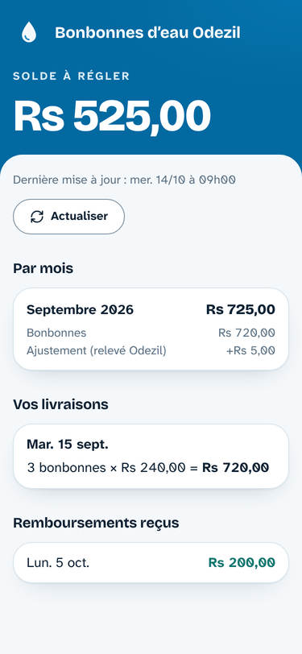
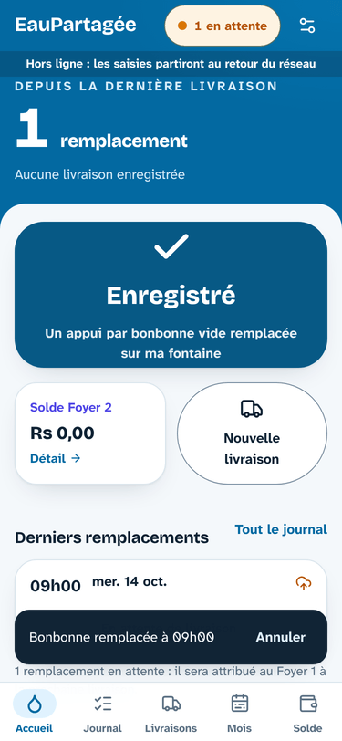

# EauPartagée

PWA mobile-first, utilisable hors ligne, pour suivre les bonbonnes d'eau **Odezil** partagées entre deux foyers à Maurice :

- le **Foyer 1** (vous, administrateur) enregistre chaque bonbonne remplacée sur sa fontaine, d'**un appui** ;
- à chaque passage du livreur, vous saisissez la **date** et le **total** de bonbonnes remplacées : l'app attribue au Foyer 1 ses remplacements enregistrés et **la différence au Foyer 2** ;
- chaque mois, le **SOA** d'Odezil est rapproché du total attendu, et l'écart est traité ;
- le **Foyer 2** (beaux-parents) consulte son solde, ses livraisons et ses remboursements sur une **page en lecture seule**, par un lien privé.

| Accueil | Nouvelle livraison | Mois | Page du Foyer 2 | Hors ligne |
| --- | --- | --- | --- | --- |
|  |  |  |  |  |

Stack : Vite, React 19, TypeScript, Tailwind CSS 4, vite-plugin-pwa, Dexie (IndexedDB), Supabase (Postgres, Auth, Storage), déploiement Vercel. Les choix techniques reprennent le projet **Presence** ; le détail est dans [`docs/PLAN.md`](docs/PLAN.md) et les règles dans [`CLAUDE.md`](CLAUDE.md).

## Sommaire

1. [Démarrage local](#1-démarrage-local)
2. [Créer le projet Supabase](#2-créer-le-projet-supabase)
3. [Connexion avec Google](#3-connexion-avec-google)
4. [Variables d'environnement](#4-variables-denvironnement)
5. [Déployer sur Vercel](#5-déployer-sur-vercel)
6. [Première connexion et lien du Foyer 2](#6-première-connexion-et-lien-du-foyer-2)
7. [Installer l'app sur les téléphones](#7-installer-lapp-sur-les-téléphones)
8. [Règles de calcul](#8-règles-de-calcul)
9. [Hors ligne et synchronisation](#9-hors-ligne-et-synchronisation)
10. [Sécurité](#10-sécurité)
11. [Tests](#11-tests)
12. [Dépannage](#12-dépannage)

## 1. Démarrage local

Node 22 (ou 24).

```bash
npm install
cp .env.example .env.local   # puis renseigner les valeurs (voir 4)
npm run dev                   # http://localhost:5173
```

## 2. Créer le projet Supabase

Les libellés du tableau de bord Supabase peuvent varier légèrement.

### 2.1 Projet et schéma

1. Sur [supabase.com](https://supabase.com), créez un projet dans une région proche de Maurice (par exemple **Mumbai, `ap-south-1`**).
2. Appliquez les migrations, **au choix** :
   - **SQL Editor** : exécutez, dans cet ordre, le contenu de :
     1. `supabase/migrations/20261009120000_schema.sql` (tables, sécurité, triggers) ;
     2. `supabase/migrations/20261009120100_rpc.sql` (fonctions de l'app) ;
     3. `supabase/migrations/20261009120200_storage.sql` (bucket `documents`) ;
     4. `supabase/migrations/20261009120300_reference_data.sql` (prix initial Rs 240).
   - **CLI Supabase** :
     ```bash
     npx supabase login
     npx supabase link --project-ref <référence-du-projet>
     npx supabase db push
     ```
3. Vérifiez dans **Storage** que le bucket **`documents`** existe et qu'il est **privé**.

### 2.2 Autoriser votre adresse (une seule fois)

L'adresse de l'administrateur n'est jamais écrite dans le code. Dans le **SQL Editor** :

```sql
insert into public.admin_allowlist (email)
values (lower('vous@exemple.com'))
on conflict (email) do nothing;
```

Seule cette adresse peut créer un compte (un trigger refuse les autres), puis lire et écrire les données (RLS via `public.is_admin()`).

### 2.3 Authentification

Dans **Authentication** :

1. **Sign In / Providers → Email** : fournisseur activé, **« Confirm email » activé** (`is_admin()` exige un email confirmé). Longueur du code : 6 chiffres.
2. **Emails → Templates → Magic Link** : remplacez le contenu par celui de [`supabase/templates/magic_link.html`](supabase/templates/magic_link.html). Il contient **le lien et le code à 6 chiffres** : sur iPhone, le lien s'ouvre dans Safari et non dans l'app installée, il faut alors saisir le code dans l'app.
3. **Emails → SMTP Settings** : votre SMTP personnalisé (déjà en place) permet de recevoir les emails sans la limite du service intégré.
4. **URL Configuration** :
   - **Site URL** : l'URL de production, par exemple `https://eaupartagee.vercel.app` ;
   - **Redirect URLs** : uniquement des domaines **exacts** :
     - `https://eaupartagee.vercel.app/**` (votre domaine de production) ;
     - `http://localhost:5173/**` et `http://localhost:4173/**` (développement).

   > ⚠️ **Jamais de joker dans le domaine** (`https://*.vercel.app/**` ou `https://*-<équipe>.vercel.app/**`) : le `*` accepte aussi les tirets, et n'importe quel projet Vercel tiers pourrait alors recevoir votre code de connexion. Pour tester la connexion sur une preview, ajoutez **son adresse exacte** (par exemple `https://eaupartagee-git-ma-branche-<équipe>.vercel.app/**`), puis retirez-la.

### 2.4 Clés

**Project Settings → API Keys** : notez l'**URL du projet** (`https://<référence>.supabase.co`) et la clé **publishable** (`sb_publishable_…`), ou l'ancienne clé **anon** d'un projet plus ancien. La clé **secret / service_role** ne sert **jamais** : ni dans l'app, ni sur Vercel.

## 3. Connexion avec Google

Vous pouvez réutiliser votre client OAuth existant : il suffit de mettre à jour ses adresses.

1. **Google Cloud Console** ([console.cloud.google.com](https://console.cloud.google.com)) → **Google Auth Platform** (anciennement « Écran de consentement OAuth ») :
   - *Branding* : nom de l'app (« EauPartagée ») et email d'assistance ;
   - *Audience* : type **Externe**, puis **Publier l'application** (seuls l'email et le profil sont demandés : pas de validation Google ; l'accès reste filtré par `admin_allowlist`) ;
   - *Clients* → votre client **Application Web** (ou **Créer un client**) :
     - **Origines JavaScript autorisées** : `https://eaupartagee.vercel.app` (et `http://localhost:5173` pour le développement) ;
     - **URI de redirection autorisés** : `https://<référence>.supabase.co/auth/v1/callback` (adresse affichée dans Supabase à l'étape 2 ; remplacez celle de l'ancien projet).
   - Notez l'**ID client** et le **code secret** (le secret ne se réaffiche pas : générez-en un nouveau si besoin).
2. **Supabase → Authentication → Sign In / Providers → Google** : activez, collez l'ID client et le secret, enregistrez.
3. Rien d'autre : le bouton « Se connecter avec Google » s'affiche dès que le fournisseur est actif. Les *Redirect URLs* de 2.3 servent aussi au retour de Google (flux PKCE, retour sur `/auth/callback`).

Google propose toujours de choisir le compte. Un autre compte Google que celui de `admin_allowlist` est refusé (« Accès non autorisé ») et n'accède à aucune donnée, même en appelant l'API directement.

## 4. Variables d'environnement

En local, dans `.env.local` (jamais versionné) ; sur Vercel, dans *Settings → Environment Variables* (Production **et** Preview) :

```dotenv
VITE_SUPABASE_URL=https://<référence>.supabase.co
VITE_SUPABASE_PUBLISHABLE_KEY=sb_publishable_xxxxxxxxxxxxxxxx
# ou, pour un projet ancien : VITE_SUPABASE_ANON_KEY=eyJhbGciOi…
VITE_ADMIN_EMAIL=vous@exemple.com
```

Ces valeurs sont **publiques par nature** : elles se retrouvent dans le code envoyé au navigateur, y compris votre adresse (`VITE_ADMIN_EMAIL`, simple garde-fou d'interface). La sécurité repose sur la RLS et `admin_allowlist`. Sans ces variables, l'app affiche « Configuration incomplète » avec le nom des variables manquantes, jamais leurs valeurs.

## 5. Déployer sur Vercel

1. Sur [vercel.com](https://vercel.com) : **Add New → Project**, importez le dépôt GitHub. `vercel.json` fixe le preset Vite, `npm run build`, le dossier `dist`, la réécriture SPA et les en-têtes (CSP, cache des assets, `no-store`, `noindex` et `no-referrer` sur `/p/…`).
2. Renseignez les variables (section 4) pour **Production** et **Preview**, puis déployez.
3. Reportez l'URL de production dans Supabase (*Site URL*, *Redirect URLs* exactes) et dans Google (origine JavaScript).
4. Ensuite, chaque push sur `main` déploie la production ; chaque pull request a sa preview (la connexion n'y fonctionne que si vous ajoutez son adresse exacte, voir 2.3).

> Domaine Supabase personnalisé : adaptez `connect-src` et `img-src` dans `vercel.json`.

## 6. Première connexion et lien du Foyer 2

1. Ouvrez l'app, touchez **Se connecter avec Google** (ou **Recevoir un lien par email**, puis le code).
2. **Réglages → Prix d'une bonbonne** : vérifiez le prix (Rs 240 par défaut). Un nouveau prix avec date d'effet ne modifie jamais les livraisons déjà enregistrées.
3. **Réglages → Lien du Foyer 2 → Générer le lien** : le lien complet n'est affiché **qu'une fois**. Copiez-le et envoyez-le au Foyer 2. Seul son hash est conservé ; vous pouvez le régénérer (l'ancien cesse de fonctionner) ou le révoquer.

## 7. Installer l'app sur les téléphones

**iPhone (Safari)** : ouvrez l'URL, touchez **Partager** puis **Sur l'écran d'accueil**, puis **Ajouter**. Lancez l'app depuis l'icône (plein écran), puis connectez-vous. Si la page Google s'ouvre dans une fenêtre Safari et que l'app n'est pas connectée après sa fermeture, utilisez **Recevoir un lien par email** et saisissez le **code**.

**Android (Chrome)** : ouvrez l'URL, puis **Réglages → Installer l'app** dans EauPartagée (ou menu ⋮ → *Installer l'application*).

La première ouverture se fait avec du réseau ; ensuite l'app s'ouvre et s'utilise hors ligne.

**Page du Foyer 2** : le Foyer 2 ouvre le lien reçu ; il peut l'ajouter à son écran d'accueil de la même façon (la page rouverte est la sienne, pas la connexion administrateur). Rien n'est enregistré sur son téléphone.

## 8. Règles de calcul

Toutes les règles sont dans `src/domain/calculations.ts`, identiques à celles de la base (tests de parité). Montants en centimes, jours à l'heure de Maurice (UTC+4).

- **Attribution d'une livraison** (date D, total T) :
  - les candidats sont les remplacements **en attente** dont le jour à Maurice est **≤ D** ;
  - le Foyer 1 reçoit `n = min(candidats, T)`, les plus anciens d'abord ;
  - **Foyer 2 = T − n** ;
  - un excédent reste en attente, avec un avertissement ;
  - sans aucun remplacement, une confirmation est demandée.
- La répartition est **figée** : un remplacement rattaché est verrouillé. Seuls « Recalculer la répartition », la modification de la date ou du total (avec aperçu avant/après) ou la suppression de la livraison la changent.
- **Prix** : figé à la création d'après le prix en vigueur à la date de livraison ; réévalué seulement si la date est corrigée.
- **Part du Foyer 2** d'une livraison = `bottles_f2 × prix appliqué`.
- **Total attendu d'un mois** = Σ `bottles_total × prix appliqué` des livraisons du mois.
- **Écart** = total SOA − total attendu.
- **Traitement de l'écart** :
  - au Foyer 2 : tout l'écart ;
  - partage 50/50 : la moitié, arrondie vers zéro, le reste au Foyer 1 ;
  - au Foyer 1, ou en attente : rien.
- **Solde du Foyer 2** = Σ parts Foyer 2 + Σ ajustements − Σ remboursements.

## 9. Hors ligne et synchronisation

- L'interface lit uniquement la base locale (IndexedDB) : elle s'ouvre et fonctionne sans réseau.
- Chaque saisie est ajoutée à une **file d'écritures**, visible tout de suite, puis envoyée **dans l'ordre** au retour du réseau. Exemple : un remplacement part toujours avant la livraison qui le rattache, et une livraison et ses rattachements partent ensemble.
- Le badge de l'en-tête affiche « N en attente » ; touchez-le pour voir le détail. Si le serveur refuse une saisie, la file s'arrête dessus, avec **Réessayer** ou **Abandonner**.
- Les bons et SOA ajoutés hors ligne restent sur le téléphone jusqu'à leur envoi. Les documents déjà envoyés se consultent en ligne (URL signée de 60 s).
- Le service worker ne met en cache que l'application elle-même, jamais les données.

## 10. Sécurité

- **RLS** sur toutes les tables ; aucun droit pour le rôle anonyme.
- Toutes les politiques passent par `public.is_admin()`. Conditions :
  - email du compte dans `admin_allowlist` ;
  - email confirmé ;
  - session non ouverte par mot de passe.
- Un trigger refuse en plus la création de tout autre compte.
- Livraison et rattachements : RPC `save_delivery`, atomique. Une contrainte vérifiée au commit garantit la cohérence de l'attribution, quel que soit le chemin d'écriture.
- **Page du Foyer 2** : RPC `get_shared_view`. Elle renvoie `null` pour un lien inconnu ou révoqué, et **uniquement** les données du Foyer 2. Jamais :
  - le total livré ni les bonbonnes du Foyer 1 ;
  - les remplacements ;
  - le total SOA ni l'écart brut ;
  - les notes ni les documents.
- Bucket `documents` privé (JPEG, PNG, WebP, PDF ; 10 Mo), réservé à l'administrateur.

## 11. Tests

```bash
npm run lint          # oxlint
npm run typecheck     # tsc -b
npm test              # domaine, synchro (fake-indexeddb), SQL (PGlite), contrastes
npm run build
npx playwright install chromium   # une fois
npm run test:e2e      # parcours à 375 px contre un faux Supabase
```

- Les **tests SQL** exécutent les vraies migrations dans **PGlite** (Postgres en WebAssembly), sans Docker. Ils couvrent les deux configurations de Supabase (droits par défaut, mode strict) :
  - isolation : un compte non autorisé ou le rôle anon ne lit ni n'écrit rien, n'appelle aucune RPC et n'accède pas au bucket ;
  - attribution : atomicité, idempotence, verrou, prix figé ;
  - page partagée : aucune donnée du Foyer 1.
- Les tests **e2e** couvrent la connexion Google (PKCE), un compte refusé, le bouton « Bonbonne remplacée », les livraisons et les bons, le SOA, le solde, le message récapitulatif, la page du Foyer 2, l'export CSV, le mode hors ligne avec service worker et l'installabilité.
- **GitHub Actions** lance lint, types, tests, build et e2e sur chaque pull request et chaque push sur `main`.

## 12. Dépannage

- **« Accès non autorisé »** : l'adresse du compte n'est pas dans `admin_allowlist` (2.2), n'est pas confirmée, ou diffère de `VITE_ADMIN_EMAIL`.
- **Google : « Erreur 400 : redirect_uri_mismatch »** : l'URI de redirection déclarée dans Google doit être exactement `https://<référence>.supabase.co/auth/v1/callback`.
- **Retour de Google ou du lien refusé par Supabase** : l'adresse de l'app manque dans les *Redirect URLs* (2.3), sous sa forme exacte.
- **« Ce lien a été ouvert dans un autre navigateur »** : un lien magique doit s'ouvrir dans le navigateur où il a été demandé ; sinon, saisissez le code à 6 chiffres.
- **« Configuration incomplète »** : variables manquantes sur Vercel (section 4), puis redéploiement.
- **Badge « Erreur »** : une saisie a été refusée ; touchez le badge pour réessayer ou abandonner cette saisie.
- **Garde d'inscription** : si votre projet interdit les triggers sur `auth.users`, la migration l'indique (NOTICE) sans échouer ; les données restent protégées par la RLS.
